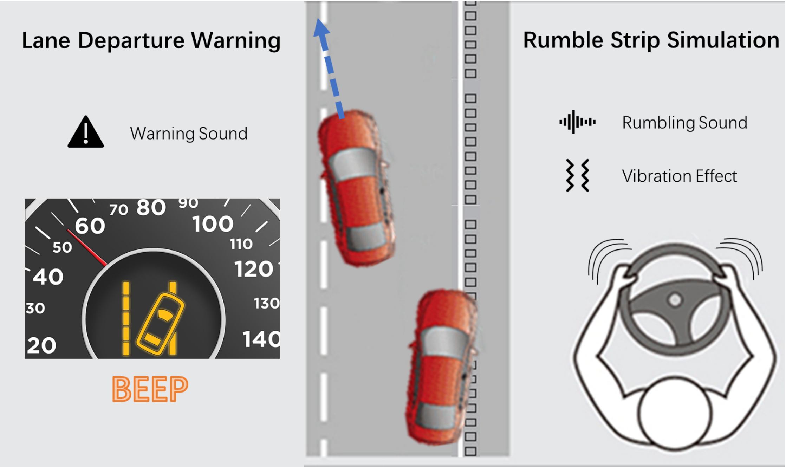
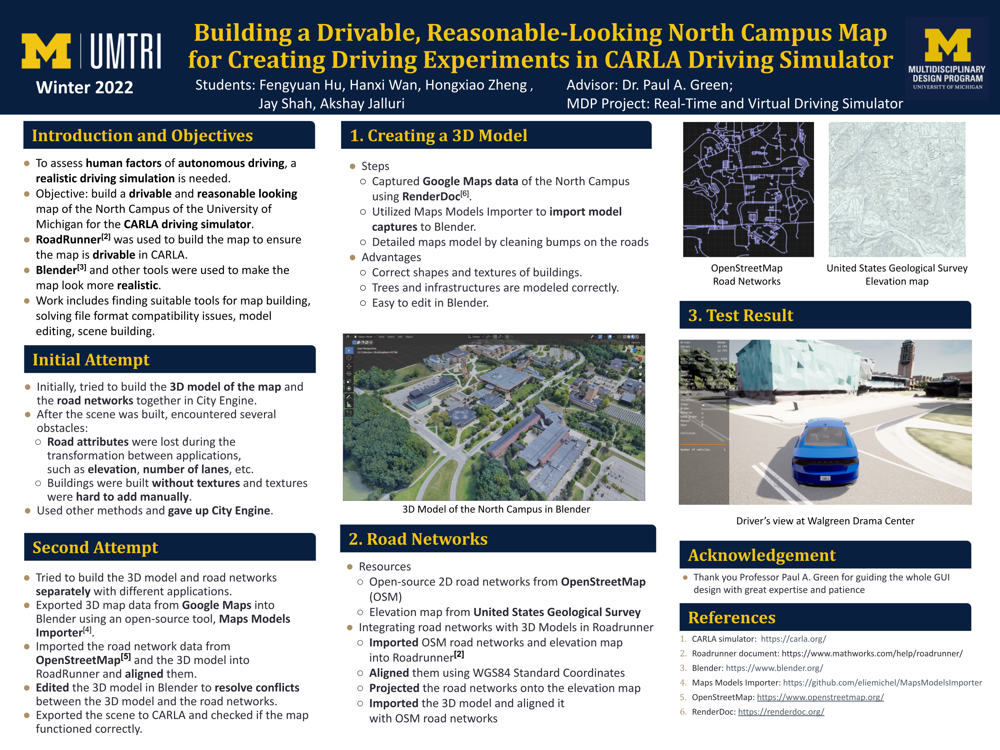

# Introduction

This project aimed to build an easy–to–use driving simulator platform to support research on driver distraction, driver workload, and driver interfaces for partially–automated vehicles.

# Highlights

- Realistic 3D models and road networks for the University of Michigan north campus

  

- Visual, auditory, and haptic effect of rumble strips based on a force-feedback driving wheel

- Lane Departure Warning

  

# Demo Videos

[Rumble Strip Demo](https://drive.google.com/file/d/1_pvuRXtgisLhKZ0AoABx2JeVjUzssbll/view?usp=sharing)

[LDW Demo](https://drive.google.com/file/d/1RuemaE8aekJq977uxfNyRrcsN4TjKdwO/view?usp=sharing)

# Poster

